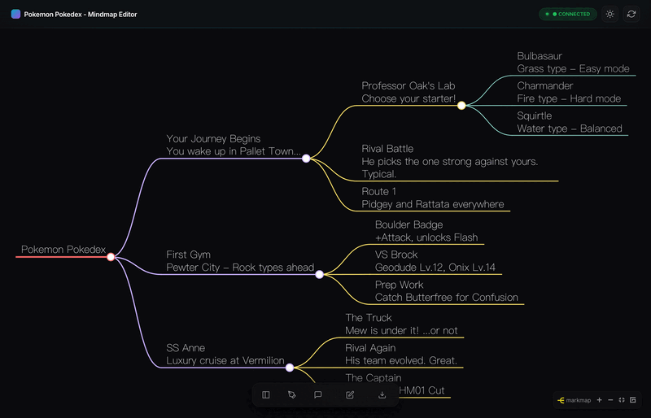

# Markdown Mindmap Studio

[](https://github.com/ChiTienHsieh/markdown-mindmap-studio/actions/workflows/ci.yml)
[](https://www.python.org/downloads/)
[](LICENSE)
[](https://github.com/ChiTienHsieh/markdown-mindmap-studio/pulls)

> 以 Markdown 檔案作為單一資料來源的互動式心智圖編輯器

[English](README.md) | 繁體中文



## 特色功能

- **Markdown 為本**: 所有內容以純文字 Markdown 檔案儲存，版本控制友善
- **互動式心智圖**: 使用 Markmap.js 呈現美觀的視覺化樹狀圖
- **雙向編輯**: 編輯 Markdown 或點擊節點皆可更新內容
- **即時同步**: 基於 WebSocket 的即時更新
- **深色/淺色主題**: 可切換主題並保存偏好設定
- **匯出功能**: PNG 圖片、獨立 HTML 網頁及 PDF 文件
- **AI 助手**: 可選的 Claude Agent 整合，輔助智慧編輯（需要 API 金鑰）

## 快速開始

```bash
# Clone 專案
git clone https://github.com/ChiTienHsieh/markdown-mindmap-studio.git
cd markdown-mindmap-studio

# 安裝相依套件（需要 uv - https://docs.astral.sh/uv/）
uv sync

# 啟動編輯器
uv run python editor/server.py

# 開啟 http://localhost:3000
```

## 鍵盤快捷鍵

| 快捷鍵 | 功能 |
|--------|------|
| `Cmd/Ctrl + 1` | 切換檔案側邊欄 |
| `Cmd/Ctrl + 2` | 切換 Markdown 編輯器 |
| `Cmd/Ctrl + 3` | 切換 AI 助手面板 |
| `Cmd/Ctrl + S` | 儲存目前檔案 |

## 專案結構

```
markdown-mindmap-studio/
├── mindmap/                 # 你的內容（巢狀目錄 + content.md）
│   ├── 01_topic/
│   │   ├── content.md       # 主題內容
│   │   ├── subtopic_a/
│   │   │   └── content.md
│   │   └── subtopic_b/
│   │       └── content.md
│   └── 02_another_topic/
│       └── ...
├── editor/                  # 網頁編輯器（FastAPI + vanilla JS）
│   ├── server.py
│   ├── static/
│   └── tests/
├── scripts/                 # 匯出工具
│   └── export_mindmap.py
└── exports/                 # 產生的 HTML/PDF 檔案
```

## 匯出

透過介面上的**匯出**按鈕直接匯出心智圖，或使用命令列：

```bash
# 產生 HTML 心智圖和 PDF 文件
uv run python scripts/export_mindmap.py

# 檔案會儲存到 exports/
```

## 自訂設定

詳見 [docs/CUSTOMIZATION.md](docs/CUSTOMIZATION.md)：
- 修改專案標題和模組名稱
- 新增模組
- 自訂 AI 助手
- 語言/地區設定

## AI 助手（選用）

啟用 AI 助手需設定 Anthropic API 金鑰：

```bash
export ANTHROPIC_API_KEY=your-key-here
uv run python editor/server.py
```

## 技術堆疊

- **後端**: FastAPI、WebSocket、Python 3.12+
- **前端**: Vanilla JS、Markmap.js、D3.js
- **匯出**: WeasyPrint（PDF）、純 Python HTML 產生

## 貢獻

歡迎 PR！請先開 issue 討論你想修改的內容。

## 授權條款

[MIT](LICENSE)
