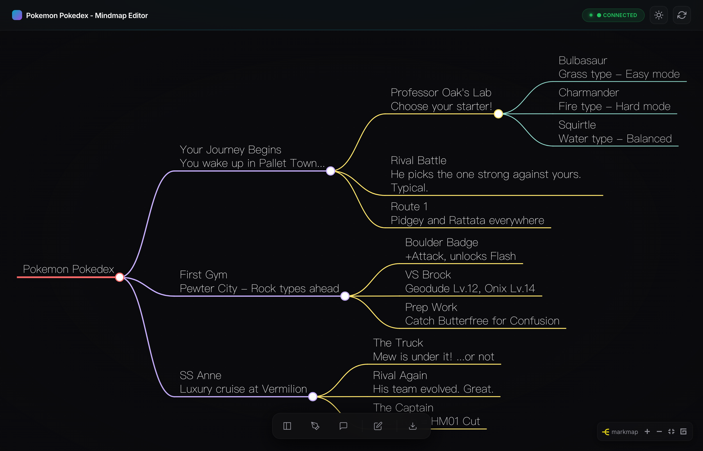

# Markdown Mindmap Studio

[](https://www.python.org/downloads/)
[](LICENSE)
[](https://github.com/ChiTienHsieh/markdown-mindmap-studio/pulls)

> Interactive mindmap editor using Markdown files as single source of truth

English | [繁體中文](README-zh.tw.md)



## Features

- **Markdown-based**: All content stored as plain Markdown files - version control friendly
- **Interactive Mindmap**: Beautiful visual tree view powered by Markmap.js
- **Bidirectional Editing**: Edit markdown directly or click nodes to update
- **Real-time Sync**: WebSocket-based live updates across all views
- **Dark/Light Theme**: Toggle between themes with persistence
- **Export Options**: PNG image, standalone HTML, and PDF document
- **AI Assistant**: Optional Claude Agent integration for smart editing (requires API key)

## Quick Start

```bash
# Clone the repo
git clone https://github.com/ChiTienHsieh/markdown-mindmap-studio.git
cd markdown-mindmap-studio

# Install dependencies (requires uv - https://docs.astral.sh/uv/)
uv sync

# Start the editor
uv run python editor/server.py

# Open http://localhost:3000 in your browser
```

## Keyboard Shortcuts

| Shortcut | Action |
|----------|--------|
| `Cmd/Ctrl + 1` | Toggle file sidebar |
| `Cmd/Ctrl + 2` | Toggle markdown editor |
| `Cmd/Ctrl + 3` | Toggle AI agent panel |
| `Cmd/Ctrl + S` | Save current file |

## Project Structure

```
markdown-mindmap-studio/
├── mindmap/                 # Your content (nested directories with content.md)
│   ├── 01_topic/
│   │   ├── content.md       # Topic content
│   │   ├── subtopic_a/
│   │   │   └── content.md
│   │   └── subtopic_b/
│   │       └── content.md
│   └── 02_another_topic/
│       └── ...
├── editor/                  # Web editor (FastAPI + vanilla JS)
│   ├── server.py
│   ├── static/
│   └── tests/
├── scripts/                 # Export tools
│   └── export_mindmap.py
└── exports/                 # Generated HTML/PDF files
```

## Export

Export your mindmap directly from the UI using the **Export** button, or via command line:

```bash
# Generate HTML mindmap and PDF document
uv run python scripts/export_mindmap.py

# Files are saved to exports/
```

## Customization

See [docs/CUSTOMIZATION.md](docs/CUSTOMIZATION.md) for:
- Changing project title and module names
- Adding new modules
- Customizing the AI assistant
- Language/locale settings

## AI Assistant (Optional)

To enable the AI assistant, set your Anthropic API key:

```bash
export ANTHROPIC_API_KEY=your-key-here
uv run python editor/server.py
```

## Tech Stack

- **Backend**: FastAPI, WebSocket, Python 3.12+
- **Frontend**: Vanilla JS, Markmap.js, D3.js
- **Export**: WeasyPrint (PDF), Pure Python HTML generation

## Contributing

PRs are welcome! Please open an issue first to discuss what you'd like to change.

## License

[MIT](LICENSE)
